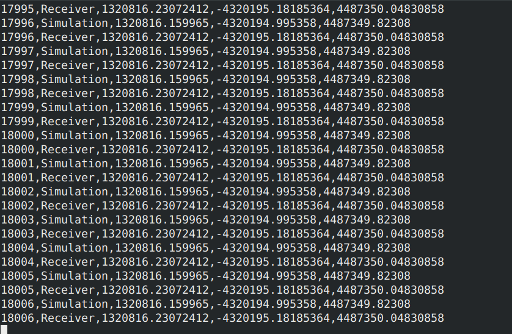

# Realtime Receiver Viewer

This plugin aims to extend the receiver screen capabilities by adding logging options to store and share different kinds of data obtained from a simulator and a receiver (usually the one connected to the simulator).

## Functionalities

- **Whiteboard**: Displays NMEA messages from the connected receiver in real-time.
- **Serial Panel**:
    - Configure and connect a receiver.
    - Configure and enable receiver messages **Network** (UDP) and **File** logging.
- **Observer Config**:
    - Configure logging capabilities for simulation observers (simulated position and receiver position).
    - Allows UDP and file logging capabilities for each observer.
    - Logs are formatted in CSV format.
- **Summary Panel**:
    - Shows real-time parsed information extracted from the connected receiver (Time, Position, Altitude MSL, Altitude Ellipsoid, HDOP, PDOP, VDOP, and Fix type).
    - Shows real-time observer positions in ECEF format.

## Guide of Use

At initialization, the plugin will display the initial screen with the messages panel on the left and the serial configuration panel on the right.

In this screen, you can set the necessary parameters to connect to the serial receiver. By default, the screen will show all the parameters initialized with default values:

- **Port**: This is the name of the serial port where the serial receiver is connected. By default, it will show the first serial port connected and will allow you to select all the available ports in `/dev`.
- **Baud rate**: Default value is 9600. The list will show the default parameters for a GNSS receiver, but with "Other" you can specify a custom baud rate.
- **Log Path**: The path where the `rvv.log` logging file will be stored. This file contains all the messages transmitted by the receiver. Default: your `$HOME` directory.
- **Open folder...**: This button opens a file search screen that allows you to select a directory for the log file.
- **Log Address**: This is the address of the server that will receive the UDP messages from the network logger. This will receive all the messages transmitted by the receiver. Default: 127.0.0.1
- **Log Port**: This is the port where the server will receive the UDP messages from the network logger. Default: 8080
- **File Logging**: This will determine if the receiver messages will be logged to a file.
- **Network Logging**: This will determine if the receiver messages will be sent to a UDP server.
- **Connect**: This button connects the receiver following the previous parameters. This changes to Disconnect if it succesfully connect to a receiver.

Once all the configurations are established, you can connect to the receiver.

If you active the Network Logging option and open a udp socket on the specified port you can see the messages on the UDP server.

On the Observer Config you can access to the configuration of the receivers and simulator observers that will show the Ecef coordinates in real time during the simulation.

The posible parameters are the following:
- Simulator observer configuration:
    - **Log Path**: The path where the `simulation_position_observer_output.csv` logging file will be stored. This file contains all the registered positions generated by the simulator. Default: your `$HOME` directory.
    - **Open folder...**: This button opens a file search screen that allows you to select a directory for the log file.
    - **Log Address**: This is the address of the server that will receive the UDP messages from the simulator observer network logger. This will receive all Ecef positions generated by the simulator. Default: 127.0.0.1
    - **Log Port**: This is the port where the server will receive the UDP messages from the simulator observer network logger. Default: 8081
    - **File Logging**: This will determine if the simulator observer positions will be logged to a file.
    - **Network Logging**: This will determine if the simulator observer positions will be sent to a UDP server.
- Receiver configuration:
    - **Log Path**: The path where the `receiver_position_output.csv` logging file will be stored. This file contains all the registered positions received from the receiver. Default: your `$HOME` directory.
    - **Open folder...**: This button opens a file search screen that allows you to select a directory for the log file.
    - **Log Address**: This is the address of the server that will receive the UDP messages from the receiver network logger. This will receive all Ecef positions received from the receiver. Default: 127.0.0.1
    - **Log Port**: This is the port where the server will receive the UDP messages from the receiver network logger. Default: 8081
    - **File Logging**: This will determine if the receiver positions will be logged to a file.
    - **Network Logging**: This will determine if the receiver positions will be sent to a UDP server.

If you active the Network Logging option on both of them aiming to the same host and port, and open a udp socket on the specified port, you can see the positions of both observers on the same UDP server.

Finally, the Summary panel shows all the information obtained and processed by the serial receiver attached and the observers.
This panel provides:
- **Receiver information**:
    - **UTC**: Time 
    - **Position**: Position on Lat/Lon format.
    - **Altitude (MSL)**: Position over the sea level.
    - **Altitude (Ellipsoid)**: Position over the ellipsoid level.
    - **PDOP**: Position Dilution of Precision, a measure of the effect of satellite geometry on the accuracy of the position fix.
    - **VDOP**: Vertical Dilution of Precision, a measure of the effect of satellite geometry on the accuracy of the vertical position fix.
    - **Fix**: The type of position fix obtained from the receiver (e.g., No Fix, 2D Fix, 3D Fix).
- **Observers**:
    - **Position Receiver**: Position given by the receiver based on GGA messages on Ecef format.
    - **Position Simulator**: Position simulated by the skydel simulator.

## Additional Information

For more details on how to use the plugin and its features, please refer to the user manual or the help section within the application.